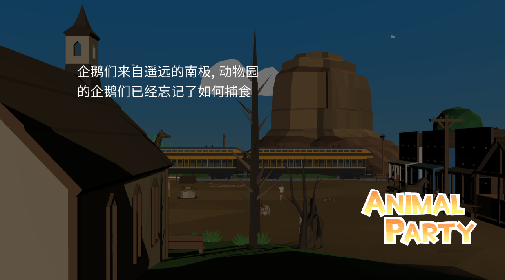

# Animal Party

  

 

This is the final project for Game Design in ZJU.

You need a pair of Joycons to play.

   
Design Doc

Project Report for Game Design 

    
Group Three

    

    

    
Animal Party, 6 Missions

    

    
    
    
    
    
    
    

2020.7

# 1. Basics

**Name:** Animal Party

**Hardware Rquirements: ** PC + Joy Con（Switch手柄）

**Genre:** Leisure, Sport

**View:** First person/Third Person

**Gameplay:** The entire game is composed of many casual games. The ultimate goal of each level is to achieve a high enough level of satisfaction for your critters by completing the game goals, and then pass the level with 3 stars.

## 1.1 Background

The player is the manager of an animal farm. In this farm, the player can play with the little animals as much as possible. Of course, sometimes small animals also have various needs, so players need to find a suitable way to comfort the small animals and satisfy them.

    
    
    
    
    
    
    

        We provide 6 levels, corresponding to raising or comforting five animals. The first level is the teaching level
    

    

## 1.2 Appearance

We use LowPoly style. What we use is a simple picture segmentation, and the colors tend to be small and fresh. We have added a wealth of post-processing effects to ensure that LowPoky has a delicate effect in time.

## 2 Similar Games

<h3>"Ring Fit Adventure"</h3>

"Ring Fit Adventure"  is a fitness game published by Nintendo Games, a role-playing game on the Switch platform. This is a fitness game. Players can load the Joy-Con on NS into the "Ring-Con" and leg straps that come with the game to recognize their movements and take risks in the game while exercising. 60 kinds of fitness can be realized in the game, and records can be uploaded to compete with players around the world.

Our game puts more emphasis on collaboration and communication with animals, so exercises are smaller than fitness rings.

<h3>"Zoo Keeper"</h3>

It is a game developed by Pyramid Games and has not been released yet. It is also raised to the fifth, but the game requires players to use the mouse to pave the road, etc., and there is a relatively complete in-app purchase system.

Our gameplay is closer to the body, using Joycon.

# 3. Handbook

## 3.1 Game Characteristics

#### Joycon

We use Joycon as an input tool and utilize Joycon's rich functions to recognize user actions and then as input. At the same time, we also used Joycon to provide vibration feedback.

#### Fun Animal AI

We wrote AI for each animal separately, so that they can have their own personality and interact with the player in different ways.

#### Rich special effects

We have added a wealth of special effects such as portal special effects.

#### Friendly to novices

We provide complete instructions for each level, so even people who are not good at playing games can quickly follow the instructions.

## 3.2 界面设计

#### Joycon 连接提示

我们的游戏需要使用 Joycon 连接电脑，对于新手来说可能不是提别熟悉，我们提供了

- Joycon 的连接教程
- Joycon 连上提示以及连上的 Joycon 的颜色

&uarr;  Joycon 连接教程, 左下角的  Joycon Icon 根据连上的 Joycon 被染成对应的颜色

#### 开始页面

我们的开始页面提供三个功能

- 开始游戏
- 选择关卡
- 退出游戏

&uarr;  开始界面

#### Joycon 按键提示

Joycon 有丰富的按键，以及我们设计了许多体感的动作，要让玩家做出正确的体感动作，我们在界面里用角色动画提供示例。

总的来说我们提供了如下的提示

- ABXY, ZR, ZL, SL, SR 等按键的提示
- 体感动作的提示
- 摇杆的提示

&uarr;  ABXY 帮助提示

&uarr;  体感动作提示

&uarr;  摇杆提示

#### 游戏进程提示

我们通过多种方式提示游戏的进程，包括了

- 提示对话框窗口
- 游戏进程结束的祝贺信息，以及通关星级
- 关卡加载的时候过渡动画以及进度提示

&uarr;  提示对话框

&uarr;  关卡结束界面

| 5%                                                           | 50%                                                          | 100%                                                         |
| ------------------------------------------------------------ | ------------------------------------------------------------ | ------------------------------------------------------------ |
|  |  |  |

&uarr;  关卡过渡动画

#### 小地图

我们的小地图支持了显示玩家的位置和朝向，而且可以用不同的图标表示环境中的的动物或者目标地点等。

#### 背包、系统和关卡选择

我们有大小背包界面，大背包界面包含了物品的名字和详细的介绍，小背包界面仅仅显示了当前背包物品，方便用户可以快速地选择物品。

我们的系统界面需要从大背包界面跳转，提供了退出游戏和进入任务选择界面。

任务选择界面提供了任务的选择，以及每一个任务的地图的预览。

#### 辅助 HUD

我们的辅助界面包括了瞄准界面以及力道指示界面。

## 3.3 物品设计

| 物品                                                         | 名称   | 作用                         |
| ------------------------------------------------------------ | ------ | ---------------------------- |
|  | 苹果   | 喂食大象、猩猩               |
|  | 香蕉   | 喂食大象、猩猩               |
|  | 萝卜   | 喂食大象、猩猩               |
|  | 樱桃   | 喂食大象、猩猩               |
|  | 椰子   | 喂食大象、猩猩               |
|  | 鱼     | 喂食大象、猩猩，企鹅用于垂钓 |
|  | 葡萄   | 喂食大象、猩猩               |
|  | 老干妈 | 喂食企鹅                     |

## 3.4 动物设计

现在的 AI 为每一关卡中的主要动物。每一个 AI 都有一个满意度，这是所有 AI 共通的设计。

#### 3.4.1 狗（新手关卡）

**自然行为：**

1、坐立不动

**可交互行为：**

1. 喂食（完成新手任务）

2. 抚摸（完成新手任务）

**好感度及行为：**无

 

#### 3.4.2 大象（第一关）

**自然行为：**

1. 站立不动

2. 仰头长啸：进食后的行为。

**可交互行为：**

1. 喂食：提升好感度。

2. 跟随：玩家需要通过自身的移动驱动大象的跟随行为，并带领其走向终点。

**好感度及行为：**

| 3：❤❤❤ | 跟随喂食者（超出一定范围则拒绝跟随） |
| ------ | ------------------------------------ |
| 2：❤❤  | 跟随喂食者（超出一定范围则拒绝跟随） |
| 1：❤   | 跟随喂食者（超出一定范围则拒绝跟随） |
| 0      | 不会跟随，等待喂食                   |
| -1     | 死亡（触发Game  Over）               |

#### 3.4.3 蛇（第一关）

**自然行为：**

1、范围内没有大象时：自由移动（在场景中游荡）

2、范围内有大象时：向大象移动并攻击（每5次会使大象好感度-1）

**可交互行为：**

1. 被玩家攻击时：没受到一次攻击则会导致hp-1，hp将为0的时候死亡。.

**好感度及行为：**无

 

#### 3.4.4 猩猩（第二关）

**自然行为：**

1. 在场景中移动

2. 捶胸口：被正确喂食后的行为

**可交互行为：**

1. 喂食：玩家可向猩猩投喂食物。

**好感度及行为：**

| 3：❤❤❤ | 原地不动(触发通关)                          |
| ------ | ------------------------------------------- |
| 2：❤❤  | 在场景中缓慢移动，在特定位置会停留          |
| 1：❤   | 在场景中正常移动，在特定位置会停留          |
| 0      | 在场景中快速移动，在特定位置会停留          |
| -1     | 在场景中极快速移动，不停留（触发Game Over） |

 

#### 3.4.5 企鹅（第四关）

**自然行为 &可交互行为：**

缓慢移动 -> 停留等待喂食 -> 如果吃到食物：快速移动 -> 缓慢移动

​             -> 如果未吃到食物：保持等待喂食的状态

**好感度及行为：**无

#### 3.4.6 小鸡（第五关）

**自然行为**：

1、小鸡将在如下行为中随机选择一种行为

- Wander
  - 小鸡会随机选择围栏中的某一些地点行走
- Eat
  - 小鸡会在原地啄玉米
- EatAndWatch
  - 小鸡会产生摇头观望的动作
- Run
  - 小鸡会跑向玉米产生的地方

**可交互行为：**无

**好感度及行为：**无

 

#### 3.4.7 其他动物（贯穿第一关至第四关）：

**自然行为：**在场景中游荡。

**可交互行为：**无

**好感度及行为：**无

## 3.5 情节设计

#### 第一关：家在哪？

**关卡目的：**带领大象吃掉尽可能多的野果，并走到终点。

**核心玩法：**解密寻路+体感QTE

**初始状态：**大象好感度为0，并处于等待喂食状态。

**关卡流程：**

1、     在场景内寻找掉落的野果

2、     将野果投喂给大象（大象好感度0->1，触发大象“跟随”的特性）

3、     带领大象走到终点

a.   如果遇到野果，就捡起来让大象吃掉，每个野果使大象好感度+1

b.   如果遇到蛇，距离较远的时候可以选择绕开；距离较近的时候，蛇会攻击大象，使大象好感度降低，玩家需要通过挥动joycon来杀死蛇。

 

**相关数值：**

喂野果：大象好感度+1

蛇的攻击：每五次攻击好感度-1

击杀蛇：每一次攻击会使蛇hp-1

 

**胜负判定：**

大象满意度3到达终点：三星通关；

大象满意度2到达终点：二星通关；

大象满意度1到达终点：一星通关；

大象满意度到达-1：Game Over。

####  第二关：别跑了！

**关卡目的：**喂给猩猩它想要的食物，使它安定下来。

**核心玩法：**解密+反应速度

**初始状态：**猩猩好感度为1**，**

**关卡流程：**

1、     猩猩抛出第一个问题

2、     玩家根据提示找到场景中对应的物品装入背包

3、     玩家在猩猩停留的时候进行投喂

​		a.   如果符合猩猩需求：猩猩好感度+1（具体行为参见AI设计）

​		b.   如果不符合需求：猩猩好感度-1（具体行为参见AI设计）

4、     再次重复1-3步骤一次

 

**相关数值：**

投喂的食物满足猩猩的需求：好感度+1

投喂的食物不满足猩猩需求：好感度-1

猩猩每绕场地两圈：好感度-1

 

**胜负判定：**

满足猩猩的两个需求的时候猩猩好感度为3：三星通关（立即通关）

满足猩猩的两个需求的时候猩猩好感度为2：二星通关

满足猩猩的两个需求的时候猩猩好感度为1：一星通关

其它：Game Over

####  第三关：使劲拉！

**关卡目的：**使用“刚刚好”的力度钓上鱼。

**核心玩法：**考验反应速度。

**初始状态：无**

**关卡流程：**

1、     抛出鱼线

2、     感受到震动以后转动摇杆：

​		a.   如果震动比较小（屏幕条数值过小）：加快摇杆转动速度。

​		b.   如果震动比较大（屏幕条数值过大）：减缓摇杆转动速度。

3、     再重复步骤1-2两次

 

**相关数值：**

见程序中动画曲线

 

**胜负判定：**

屏幕滚动条会有游标左右晃动，当时间截止后游标的位置会影响该关卡的评级（perfect/good/bad）

三次钓鱼评级均达到perfect：三星通关

两次钓鱼评级均达到perfect：二星通关

一次钓鱼评级均达到perfect：一星通关

没有一次评级达到perfect：Game Over 

 

 

####  第四关：谁饿了？

**关卡目的：**喂给企鹅尽可能多的鱼。

**核心玩法：**限时TPS射击

**初始状态：**场地中共有5只企鹅，初始行动状态均为“缓慢行走”。

**关卡流程：**

1、准备好鱼

2、当场景中有企鹅处于饥饿状态时：瞄准并投喂：

​               a. 投喂成功：企鹅状态改变（具体见动物AI）

​               b. 投喂失败：鱼的持有数-1，企鹅状态不变。

3、在限时的60秒内不断重复步骤1、2

 

**相关数值：**

游戏时间：60秒

动物行为时间：待定。

 

**胜负判定：**

投喂成功的鱼的数量≥15：三星通关

15＞投喂成功的鱼的数量≥10：二星通关

10＞投喂成功的鱼的数量≥5：一星通关

投喂成功的鱼的数量<5：Game Over 

#### 第五关：转动吧，玉米棒！

**关卡目的**：快速转动玉米棒，在有限的时间内给小鸡喂食玉米！

**核心玩法**：体感控制

**初始状态**：无

**关卡流程**：

1. 拿出JoyCon(R)手柄，保持水平
2. 根据屏幕上玉米棒的方向指示，转动JoyCon(R)，让玉米棒横向快速转动
3. 不断转动，直至有玉米粒出现在屏幕中

**相关数值**：

游戏时间：20秒

## 3.6 Joycon 输入输出设计

考虑到新意，为了与传统的键鼠操作有区分度，我们采用了老师推荐的`Joycon`作为玩家的输入设备，同时也作为触觉体感的输出设备。

​	我们使用了`JoyconLib`开源库来帮助我们获得`Joycon`上的按键输入、摇杆向量、陀螺仪、加速度、手柄朝向等数据。同时考虑到`Joycon`带来的临场感、互动感，我们将第三人称视角改成了第一人称视角，但这不代表我们之前的代码作废。如保持原有的人物移动的基础上，将摄像机绑定在人物上完成代码迁移。当前的基本按键布局如下：

| 按键         | 功能                                   |
| ------------ | -------------------------------------- |
| 左手柄摇杆   | 步行移动                               |
| 左手柄摇杆键 | 切换到奔跑模式                         |
| 右手柄摇杆   | 视角移动                               |
| 右手柄摇杆键 | 跳跃                                   |
| 右手柄 A     | 拾取道具、喂食动物、大部分场合的确定键 |
| 右手柄 B     | 取消键                                 |

​	在拥有手柄陀螺仪、加速度等数据后，我们可以根据这些数据进行较简单的动作识别。当前完成的动作识别如下：

| 按键与动作                     | 功能     |
| ------------------------------ | -------- |
| 右手柄 B + 右手柄反复横移      | 抚摸动物 |
| 右手柄 ZR + 右手柄从下往上挥动 | 抛出物体 |
| 右手柄 R + 右手柄从下往上挥动  | 驱赶动物 |
| 右手柄+左手柄同时从上往下挥动  | 甩出鱼竿 |

​	在抛出物体方面，我们也复用了修改前的射击代码。与UI结合，在我们抛出物体的时候，会将手中的物体朝着UI的准心点的方向抛去。	

​	利用`Joycon`，我们也添加了手柄震动功能，在玩家喂食动物等动作执行时会开启手柄震动，作为反馈。

## 3.7 模仿塞尔达的视角的设计

在了解人物和摄像机控制前，我们首先需要明确我们的输入：左摇杆和右摇杆的输入都是一个`Vector2`的变量，每个方向的取值范围均为`(0.0,1.0)`

无论是在第一人称还是第三人称，我们统一使用左摇杆控制人物移动，右摇杆控制摄像机移动。

在第一人称中，我们需要保持人物的移动方向与左摇杆的方向一致，右摇杆只负责改变人物的视线方向，这就保证了人物始终保持向前的方向；第三人称中，我们参考了《塞尔达传说：荒野之息》的效果，玩家的移动方向不再与人物的朝向有关，而是取决于左摇杆和此时的摄像机方向，摄像机方向即玩家的视角方向，譬如左摇杆往上推动则代表往照相机的正前方的方向移动，右摇杆则负责控制相机位置，相机始终看向人物，可以从左右、上下不同位置观察人物，同时我们设计了照相机的移动轨道来控制相机与人物的距离，这保证了相机能够从适合的位置观察人物，避免了相机陷入了地面等情况。

### 第一人称视角

#### 人物移动

为了保证左摇杆的推动方向与人物的朝向一致，我们根据人物此时在`y`轴的旋转值对左摇杆的输入进行同等的旋转，根据旋转后的方向向量对人物进行移动即可。此时得到的位移量是突变量。

考虑到人物移动的随时停止，我们选择直接控制人物的位移量而不是在刚体上添加速度。其中$\alpha$代表人物的移动速度。
$$
x = Quaternion.Euler(0, eulerAngles.y, 0) * (d_x,0, d_y) * \alpha
$$

#### 摄像机移动

考虑到玩家眩晕的问题，我们将旋转设定成渐变量，即人物不可能从上一帧朝上看突变到下一帧朝下看。因此我们只需要记录此时摄像机的旋转量即可。但需要注意的是，在右摇杆的上下移动时，只改变摄像机的旋转量，而左右移动时，我们需要同时修改人物和摄像机的旋转量。这就像人抬头时，人的身体不需要旋转，只需要改变头部的旋转量，而人面朝左面时，头部和身体都需要旋转。
$$
localEulerAngles.x\ =\ localEulerAngles.x - d_y * \beta\\
localEulerAngles.y\ =\ localEulerAngles.y + d_x * \gamma
$$

### 第三人称视角

#### 人物移动

在位移量上，与第一人称差别不大，只是根据摄像机在`y`轴的旋转值，而不是人物此时的旋转值，对左摇杆进行旋转，这保证了人物移动的方向与玩家的游戏画面一致。
$$
x = Quaternion.Euler(0, camera.eulerAngles.y, 0) * (d_x,0, d_y) * \alpha
$$
移动人物后，我们需要修改人物此时的旋转方向。在这里我们首先确定一个前提，就是左摇杆往上推动的方向(`Vector2(0.0,1.0)`)，在游戏中即代表此时摄像机的正前方方向。由此我们可以确定人物的旋转逻辑：

1. 先将人物的正前方确定为摄像机的正前方方向
2. 计算此时左摇杆的输入向量与左摇杆向上推的方向向量的夹角$\theta$
3. 人物在`y`轴上旋转$\theta$角

#### 摄像机移动

**水平移动**

摄像机的水平移动较容易实现，只需要摄像机以人为中心，以人物的正上方为轴进行旋转即可。

**垂直移动**

如图，以人物为中心，人物的正后方为`x`轴正方向，人物的正上方为`y`轴正上方建立坐标系。摄像机的位置就在类椭圆曲线上确定（实际应用中人物与摄像机的距离并不存在椭圆关系，只是这里为了表达方便）。

切换到第三视角后，初始化$\theta$角为90°，每次上下推动右手柄时对应的修改$\theta$角，通过$\theta$我们即可确定此时人物与摄像机的距离$d$。确定后我们即可确定此时摄像机在`x`、`y`轴上距离人的位移量。
$$
d_x = -sin(\theta) * d\\
d_x = -cos(\theta) * d
$$

确定了水平移动和垂直移动后，我们就可以确定摄像机的位置了，最后只需要保持摄像机的正前方指向玩家即可。

  
 
&uarr;  第一视角

 
 
&uarr;  第三视角 1

 
 
&uarr;  第三视角 2

# 4. 制作说明书

## 4.1 制作团队

我们区分如下几个任务

- UI，整合, 画面调教, 1 人
- 游戏逻辑，整合, 2 人
- 动物 AI, 1 人
- Shader 特效, 策划, 1 人
- 背包系统, 2 人
- 场景布置，音乐, 1 人

## 4.2 制作工具

**引擎:** Unity 2019.3.3f1

**Icon:** Powerpoint 2019

**模型:** Maya, Substance Painter, Marmoset Toolbag

**场景贴图调色:** Photoshop

## 4.3 游戏开发迭代目标

#### 初期工作

- [x] AI 方面: 实现第一关 AI 代码 （环境交互等）

- [x] UI 方面: 实现基础的动作提示以及开场界面
- [x] 游戏逻辑: 实现跑跳等动作
- [x] 游戏逻辑: 体感交互
- [x] 游戏逻辑: 物品拾取
- [x] 整合: AI 整合如游戏逻辑，能相互交互，初步完成第一关逻辑

#### 中期工作

- [x] 背包系统的引入
- [x] UI 整合入第一关，提供提示信息
- [x] AI 和策划合作，负责完成余下关卡 (2-4 关)
- [x] UI 实现场景切换，小地图，摇杆和辅助 HUD 等功能
- [x] AI 收到击打变红，可视化动物状态
- [x] 音乐引入

#### 后期工作

- [x] 画面调优，统一风格
- [x] 第五关的设计和实现
- [x] 优化 UI 交互，UI小地图增加图标功能
- [x] UI 增加 小背包界面
- [x] 重新封装输入层，增强 Joycon 的功能，解决 Joycon 关卡切换造成的卡顿
- [x] 每一关开始提供完整的教程
- [ ] 任务系统

# 5. 用户指南

**注: 本部分同用户手册**

## Joycon 连接

你需要两个 Joycon (左手+右手) 才能完整体验这个游戏。可以按照游戏中的提示进行连接:

首先点击 `OPEN SETTINGS` 按钮,  打开蓝牙设置，点击开启蓝牙，按住 Joycon 配对键，然后在 Windows 蓝牙设备中点击如下按钮:

如果其中之一连接上你可以看到:

| 左下角图片                                                   | 含义                                                       |
| ------------------------------------------------------------ | ---------------------------------------------------------- |
|  | 左 Joycon 已经连接并且识别成功，右 Joycon 还未连接或者识别 |
|  | 右 Joycon 已经连接并且识别成功，左 Joycon 还未连接或者识别 |

**Joycon 在连接上 Windows 之后可能需要等 5-10s 左右，游戏才能检测到**

#### 可能遇到的问题

1. Joycon 在 Windows 里显示已配对，但是游戏检测不到

Joycon 必须是 **已连接** 状态游戏才能检测。请删除设备重新按照上述步骤连接

2. Joycon 无法连接 Windows

Joycon 没电了

3. Joycon 延迟高

重启电脑或者换个 Joycon 试试

## 开始游戏

开始界面:

右手 Joycon 上下移动， 键选择。

选择 **Start** 即可从教学关卡开始游戏。

选择 **Missions** 即可选择关卡

选择 **Exit** 退出游戏

##  游戏中的按键与图标含义

在游戏中按  , 然后按 **ZR** 就可以看到上面的提示

## 背包

在关卡中，您可以在任何时候打开背包，您可以点击 右 Joycon 的  按键打开背包 （时间会暂停）。

或者左手 Joycon 的    按键快速预览背包 （时间会减速为原来的 1%）。

### 完整背包

通过摇杆  来上下移动选择框选择物品

按  选择物品并且关闭 UI

按  取消选择，这时候您手里还是原来的物品

### 快速预览背包

快速预览背包可以让您快速选择物品。

通过摇杆  来左右移动选择框选择物品

按  选择物品并且关闭 UI

按  取消选择，这时候您手里还是原来的物品

## 关卡选择

在开场动画的时候要选择关卡请进入 **Missions** 选项。

在游戏过程中您也可以切换关卡：

1. 点击 右 Joycon 的  按键打开背包
2. 点击     进入系统界面
3. 点击  选择 Missions

然后您会看到如下界面:

通过摇杆  来上下移动选择框选择关卡

按  选择关卡

按  取消选择

## 游戏流程

### 0. 教学关卡

在教学关卡中, 您会看到一些提示，一般性按  即可继续。

首先是 Joycon 摇杆的使用和测试:

这里可以看到中间的虚拟摇杆表示我们已经读到摇杆的输入。在这里您可以测试摇杆是否正常工作，并且熟悉操作。

然后您会被要求去拾取香肠，切换视角等操作，只要按照指示做就行了。如下是一些案例

**要结束这个关卡按  **  **即可**

### 1. 第一关

第一关要求你把大象带到终点。但是你必须给大象喂食，才能博取大象好感，大象才会跟随你。同时你要提防蛇对大象的攻击。

首先是了解我们的小地图:

| 图标                                                         | 含义           |
| ------------------------------------------------------------ | -------------- |
|  | 代表大象的位置 |
| 

 | 代表终点位置   |
|  | 当前玩家位置   |

在路上会有蛇来进攻，你必须按住  并且挥动 Joycon 攻击蛇。

### 2. 第二关

第二关需要你根据猩猩的需要给猩猩喂食。所有的食物都散落在地上。猩猩头上的气泡会告诉您要喂食什么。

这一关里你可能需要用到背包。

### 3. 第三关

第三关你需要想获取鱼竿，然后走到船上 （如图发光处）

甩动 Joycon 从而甩出鱼竿，按  开始钓鱼，这时候你需要不断旋转 Joycon 收鱼线，保证力道标识位置在中央绿色处。

### 4. 第四关

这一关你至于要捡起地面上的老干妈，按住  键向前抛掷，只要砸中企鹅，企鹅就会吃下去。投喂10次即可三星过关。

### 5. 第五关

第五关的任务是给饥饿的小鸡喂食玉米。在这一关，你需要水平手持JoyCon(R)手柄，并模仿剥玉米的动作，转动JoyCon(R)手柄。

在转动玉米的过程中，玉米粒会不断弹出，随着玉米粒的增多，左上角的爱心会逐渐增多，游戏结束后，你将会收获与爱心数目相同的星级评价。

当然，当右上角的倒计时结束后或者你收集满了爱心后，游戏就会结束。

  

## 键盘映射

> Shift 按键是对应按下 Joycon 的摇杆，即加速奔跑。