

   
设计文档

游戏程序设计课程报告

指导老师: 耿卫东, 李泽宇, 吴翔

    
第三组

    
林昭炜 吴思晗 赵浩钧 冯伟

    
倪文逍 倪文遥 钟子鹏 高新宇

    

    

    
Animal Party, 6 个关卡

    

    
    
    
    
    
    
    

2020.7

# 1. 概述

**游戏名称：**Animal Party

**硬件需求：**PC + Joy Con（Switch手柄）

**游戏类型：**休闲益智，体感，健身

**游戏视角：**第一人称/第三人称（可切换）

**游戏玩法：**整个游戏是由很多休闲类小游戏组成，每一关的最终目标是通过完成游戏目标，使你的小动物达到足够高的满意度，进而三星通关。

## 1.1 故事概要

玩家是一名动物庄园的管理者，在这个庄园里，玩家可以尽情与小动物们玩耍。当然，有时候小动物们也会有各种各样的需求，所以玩家需要找到合适的方式来安抚小动物，使它们得到满足。

    
    
    
    
    
    
    

        我们提供了 6 个关卡，分别对应饲养或者安抚五个动物。其中第一个关卡是教学关卡
    

    

## 1.2 外观

我们使用 LowPoly 风格。我们的使用的是简约的画面分割，颜色偏向小清新。我们加入了丰富的后处理效果，保证及时是 LowPoky 也有细腻的效果。

# 2. 游戏市场分析

## 2.1 目标的玩家市场

本游戏是一款探索向和一个体感的游戏。游戏兼具难度、趣味性。我们的目标群体是休闲玩家，不会对玩家的技术水平有很高的要求，同时游戏内也存在一定的剧情要素。总体来说是一款面向入门级的体感运动类游戏。

## 2.2 可玩性

作品主打探索生存游戏体验。由于游戏在成品概念上仍然是一款偏向于技术向的作品，所以不会有非常完整的剧情。
我们致力于完成更好的画面呈现、界面交互和更为流畅的游戏体验。

## 2.3 同类游戏对比

<h3>《健身环大冒险》</h3>

《健身环大冒险》（Ring Fit Adventure）是任天堂游戏公司出版发行的健身游戏，Switch平台角色扮演游戏。这是一款健身游戏，玩家可将NS上的Joy-Con装入游戏自带的“Ring-Con”及腿部固定带中， 以识别自己的动作，一边健身一边在游戏中冒险。在游戏中可实现60种的健身，并且可将记录上传，与世界范围内的玩家竞争。

我们的游戏更加强调与动物的协作沟通，因此运动相比健身环要小。

<h3>《Zoo Keeper》</h3>

是由 Pyramid Games 开发的游戏，暂时还没有发布。其也是饲养到那个五，但是玩法上需要玩家用鼠标铺路等，有较为完整的内购等系统。

我们的游戏玩法更加贴近体感，用到了 Joycon。

# 3. 游戏说明书

## 3.1 Game Characteristics

#### Joycon 体感交互

我们使用了 Joycon 作为输入工具，利用了 Joycon 丰富的功能，识别用户的动作、进而作为输入。同时我们还利用 Joycon 提供了震动反馈。

#### 有个性的动物 AI

我们为每一个动物单独写了 AI，让他们能有自己的个性，用不同的方式和玩家交互。

#### 丰富的特效

我们增加了丰富的特效比如传送门特效。

#### 对新手友好

我们每一关都提供了完整的指示，即便是平时不擅长玩游戏的人也能按照指引很快地掌握。

## 3.2 界面设计

#### Joycon 连接提示

我们的游戏需要使用 Joycon 连接电脑，对于新手来说可能不是提别熟悉，我们提供了

- Joycon 的连接教程
- Joycon 连上提示以及连上的 Joycon 的颜色

&uarr;  Joycon 连接教程, 左下角的  Joycon Icon 根据连上的 Joycon 被染成对应的颜色

#### 开始页面

我们的开始页面提供三个功能

- 开始游戏
- 选择关卡
- 退出游戏

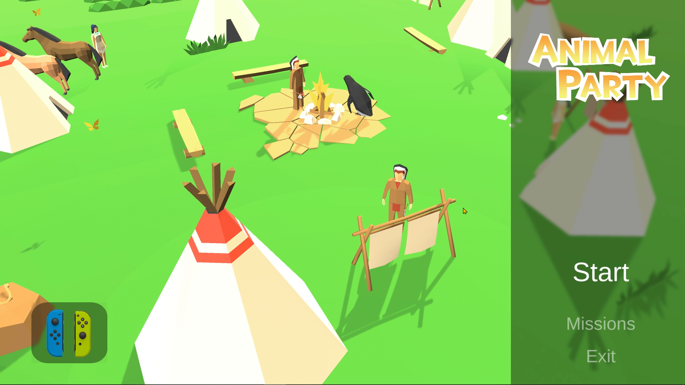

&uarr;  开始界面

#### Joycon 按键提示

Joycon 有丰富的按键，以及我们设计了许多体感的动作，要让玩家做出正确的体感动作，我们在界面里用角色动画提供示例。

总的来说我们提供了如下的提示

- ABXY, ZR, ZL, SL, SR 等按键的提示
- 体感动作的提示
- 摇杆的提示

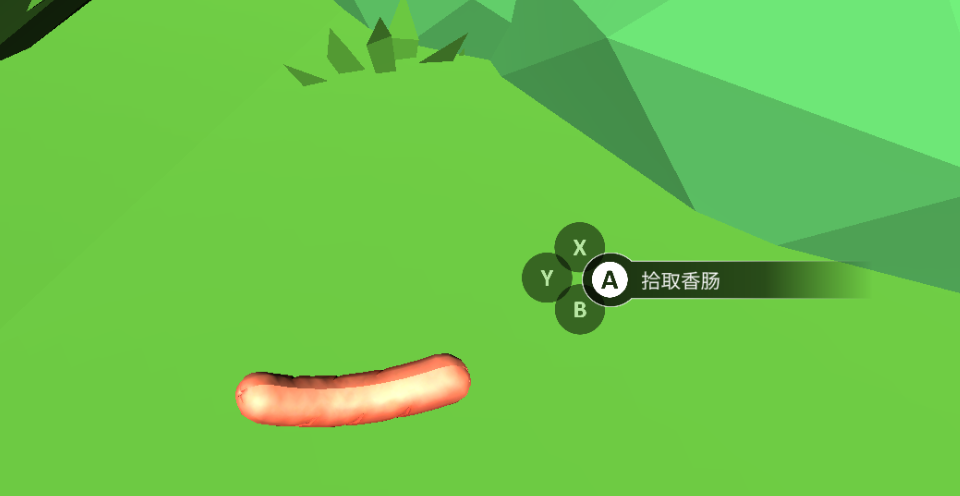

&uarr;  ABXY 帮助提示

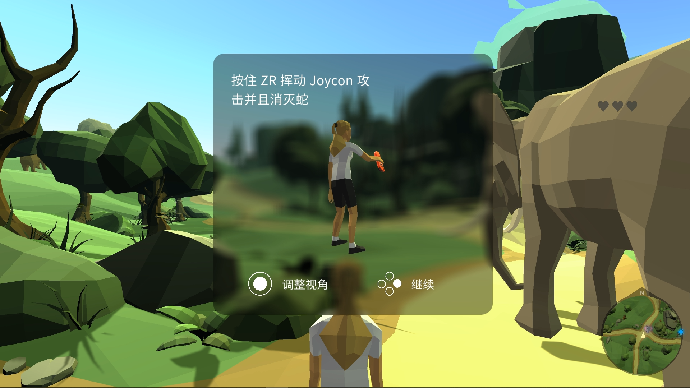

&uarr;  体感动作提示

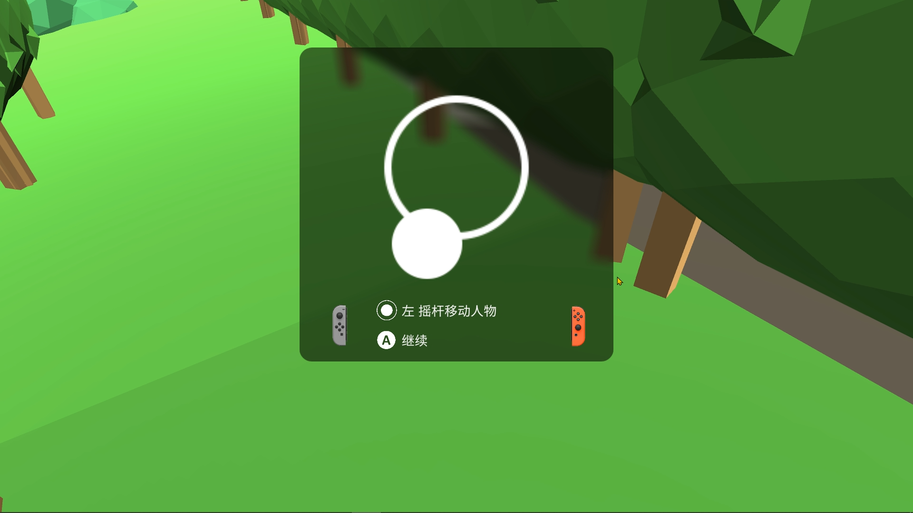

&uarr;  摇杆提示

#### 游戏进程提示

我们通过多种方式提示游戏的进程，包括了

- 提示对话框窗口
- 游戏进程结束的祝贺信息，以及通关星级
- 关卡加载的时候过渡动画以及进度提示

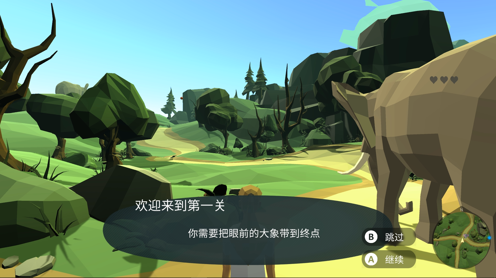

&uarr;  提示对话框

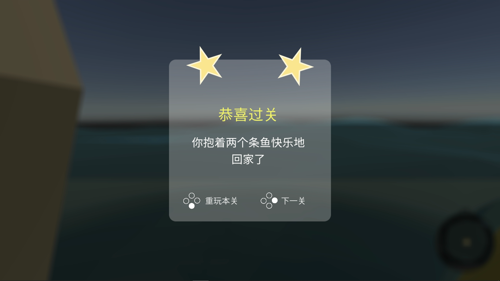

&uarr;  关卡结束界面

| 5%                                                           | 50%                                                          | 100%                                                         |
| ------------------------------------------------------------ | ------------------------------------------------------------ | ------------------------------------------------------------ |
|  |  | 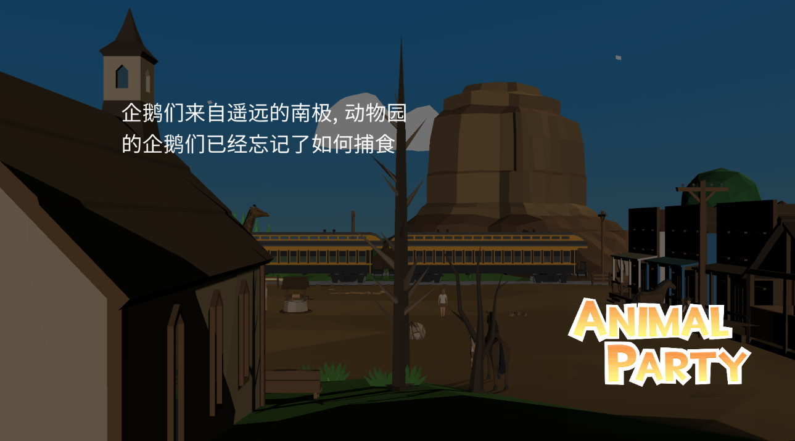 |

&uarr;  关卡过渡动画

#### 小地图

我们的小地图支持了显示玩家的位置和朝向，而且可以用不同的图标表示环境中的的动物或者目标地点等。

#### 背包、系统和关卡选择

我们有大小背包界面，大背包界面包含了物品的名字和详细的介绍，小背包界面仅仅显示了当前背包物品，方便用户可以快速地选择物品。

我们的系统界面需要从大背包界面跳转，提供了退出游戏和进入任务选择界面。

任务选择界面提供了任务的选择，以及每一个任务的地图的预览。

#### 辅助 HUD

我们的辅助界面包括了瞄准界面以及力道指示界面。

## 3.3 物品设计

| 物品                                                         | 名称   | 作用                         |
| ------------------------------------------------------------ | ------ | ---------------------------- |
|  | 苹果   | 喂食大象、猩猩               |
|  | 香蕉   | 喂食大象、猩猩               |
|  | 萝卜   | 喂食大象、猩猩               |
|  | 樱桃   | 喂食大象、猩猩               |
|  | 椰子   | 喂食大象、猩猩               |
|  | 鱼     | 喂食大象、猩猩，企鹅用于垂钓 |
|  | 葡萄   | 喂食大象、猩猩               |
|  | 老干妈 | 喂食企鹅                     |

## 3.4 动物设计

现在的 AI 为每一关卡中的主要动物。每一个 AI 都有一个满意度，这是所有 AI 共通的设计。

#### 3.4.1 狗（新手关卡）

**自然行为：**

1、坐立不动

**可交互行为：**

1. 喂食（完成新手任务）

2. 抚摸（完成新手任务）

**好感度及行为：**无

 

#### 3.4.2 大象（第一关）

**自然行为：**

1. 站立不动

2. 仰头长啸：进食后的行为。

**可交互行为：**

1. 喂食：提升好感度。

2. 跟随：玩家需要通过自身的移动驱动大象的跟随行为，并带领其走向终点。

**好感度及行为：**

| 3：❤❤❤ | 跟随喂食者（超出一定范围则拒绝跟随） |
| ------ | ------------------------------------ |
| 2：❤❤  | 跟随喂食者（超出一定范围则拒绝跟随） |
| 1：❤   | 跟随喂食者（超出一定范围则拒绝跟随） |
| 0      | 不会跟随，等待喂食                   |
| -1     | 死亡（触发Game  Over）               |

#### 3.4.3 蛇（第一关）

**自然行为：**

1、范围内没有大象时：自由移动（在场景中游荡）

2、范围内有大象时：向大象移动并攻击（每5次会使大象好感度-1）

**可交互行为：**

1. 被玩家攻击时：没受到一次攻击则会导致hp-1，hp将为0的时候死亡。.

**好感度及行为：**无

 

#### 3.4.4 猩猩（第二关）

**自然行为：**

1. 在场景中移动

2. 捶胸口：被正确喂食后的行为

**可交互行为：**

1. 喂食：玩家可向猩猩投喂食物。

**好感度及行为：**

| 3：❤❤❤ | 原地不动(触发通关)                          |
| ------ | ------------------------------------------- |
| 2：❤❤  | 在场景中缓慢移动，在特定位置会停留          |
| 1：❤   | 在场景中正常移动，在特定位置会停留          |
| 0      | 在场景中快速移动，在特定位置会停留          |
| -1     | 在场景中极快速移动，不停留（触发Game Over） |

 

#### 3.4.5 企鹅（第四关）

**自然行为 &可交互行为：**

缓慢移动 -> 停留等待喂食 -> 如果吃到食物：快速移动 -> 缓慢移动

​             -> 如果未吃到食物：保持等待喂食的状态

**好感度及行为：**无

#### 3.4.6 小鸡（第五关）

**自然行为**：

1、小鸡将在如下行为中随机选择一种行为

- Wander
  - 小鸡会随机选择围栏中的某一些地点行走
- Eat
  - 小鸡会在原地啄玉米
- EatAndWatch
  - 小鸡会产生摇头观望的动作
- Run
  - 小鸡会跑向玉米产生的地方

**可交互行为：**无

**好感度及行为：**无

 

#### 3.4.7 其他动物（贯穿第一关至第四关）：

**自然行为：**在场景中游荡。

**可交互行为：**无

**好感度及行为：**无

## 3.5 情节设计

#### 第一关：家在哪？

**关卡目的：**带领大象吃掉尽可能多的野果，并走到终点。

**核心玩法：**解密寻路+体感QTE

**初始状态：**大象好感度为0，并处于等待喂食状态。

**关卡流程：**

1、     在场景内寻找掉落的野果

2、     将野果投喂给大象（大象好感度0->1，触发大象“跟随”的特性）

3、     带领大象走到终点

a.   如果遇到野果，就捡起来让大象吃掉，每个野果使大象好感度+1

b.   如果遇到蛇，距离较远的时候可以选择绕开；距离较近的时候，蛇会攻击大象，使大象好感度降低，玩家需要通过挥动joycon来杀死蛇。

 

**相关数值：**

喂野果：大象好感度+1

蛇的攻击：每五次攻击好感度-1

击杀蛇：每一次攻击会使蛇hp-1

 

**胜负判定：**

大象满意度3到达终点：三星通关；

大象满意度2到达终点：二星通关；

大象满意度1到达终点：一星通关；

大象满意度到达-1：Game Over。

####  第二关：别跑了！

**关卡目的：**喂给猩猩它想要的食物，使它安定下来。

**核心玩法：**解密+反应速度

**初始状态：**猩猩好感度为1**，**

**关卡流程：**

1、     猩猩抛出第一个问题

2、     玩家根据提示找到场景中对应的物品装入背包

3、     玩家在猩猩停留的时候进行投喂

​		a.   如果符合猩猩需求：猩猩好感度+1（具体行为参见AI设计）

​		b.   如果不符合需求：猩猩好感度-1（具体行为参见AI设计）

4、     再次重复1-3步骤一次

 

**相关数值：**

投喂的食物满足猩猩的需求：好感度+1

投喂的食物不满足猩猩需求：好感度-1

猩猩每绕场地两圈：好感度-1

 

**胜负判定：**

满足猩猩的两个需求的时候猩猩好感度为3：三星通关（立即通关）

满足猩猩的两个需求的时候猩猩好感度为2：二星通关

满足猩猩的两个需求的时候猩猩好感度为1：一星通关

其它：Game Over

####  第三关：使劲拉！

**关卡目的：**使用“刚刚好”的力度钓上鱼。

**核心玩法：**考验反应速度。

**初始状态：无**

**关卡流程：**

1、     抛出鱼线

2、     感受到震动以后转动摇杆：

​		a.   如果震动比较小（屏幕条数值过小）：加快摇杆转动速度。

​		b.   如果震动比较大（屏幕条数值过大）：减缓摇杆转动速度。

3、     再重复步骤1-2两次

 

**相关数值：**

见程序中动画曲线

 

**胜负判定：**

屏幕滚动条会有游标左右晃动，当时间截止后游标的位置会影响该关卡的评级（perfect/good/bad）

三次钓鱼评级均达到perfect：三星通关

两次钓鱼评级均达到perfect：二星通关

一次钓鱼评级均达到perfect：一星通关

没有一次评级达到perfect：Game Over 

 

 

####  第四关：谁饿了？

**关卡目的：**喂给企鹅尽可能多的鱼。

**核心玩法：**限时TPS射击

**初始状态：**场地中共有5只企鹅，初始行动状态均为“缓慢行走”。

**关卡流程：**

1、准备好鱼

2、当场景中有企鹅处于饥饿状态时：瞄准并投喂：

​               a. 投喂成功：企鹅状态改变（具体见动物AI）

​               b. 投喂失败：鱼的持有数-1，企鹅状态不变。

3、在限时的60秒内不断重复步骤1、2

 

**相关数值：**

游戏时间：60秒

动物行为时间：待定。

 

**胜负判定：**

投喂成功的鱼的数量≥15：三星通关

15＞投喂成功的鱼的数量≥10：二星通关

10＞投喂成功的鱼的数量≥5：一星通关

投喂成功的鱼的数量<5：Game Over 

#### 第五关：转动吧，玉米棒！

**关卡目的**：快速转动玉米棒，在有限的时间内给小鸡喂食玉米！

**核心玩法**：体感控制

**初始状态**：无

**关卡流程**：

1. 拿出JoyCon(R)手柄，保持水平
2. 根据屏幕上玉米棒的方向指示，转动JoyCon(R)，让玉米棒横向快速转动
3. 不断转动，直至有玉米粒出现在屏幕中

**相关数值**：

游戏时间：20秒

## 3.6 Joycon 输入输出设计

考虑到新意，为了与传统的键鼠操作有区分度，我们采用了老师推荐的`Joycon`作为玩家的输入设备，同时也作为触觉体感的输出设备。

​	我们使用了`JoyconLib`开源库来帮助我们获得`Joycon`上的按键输入、摇杆向量、陀螺仪、加速度、手柄朝向等数据。同时考虑到`Joycon`带来的临场感、互动感，我们将第三人称视角改成了第一人称视角，但这不代表我们之前的代码作废。如保持原有的人物移动的基础上，将摄像机绑定在人物上完成代码迁移。当前的基本按键布局如下：

| 按键         | 功能                                   |
| ------------ | -------------------------------------- |
| 左手柄摇杆   | 步行移动                               |
| 左手柄摇杆键 | 切换到奔跑模式                         |
| 右手柄摇杆   | 视角移动                               |
| 右手柄摇杆键 | 跳跃                                   |
| 右手柄 A     | 拾取道具、喂食动物、大部分场合的确定键 |
| 右手柄 B     | 取消键                                 |

​	在拥有手柄陀螺仪、加速度等数据后，我们可以根据这些数据进行较简单的动作识别。当前完成的动作识别如下：

| 按键与动作                     | 功能     |
| ------------------------------ | -------- |
| 右手柄 B + 右手柄反复横移      | 抚摸动物 |
| 右手柄 ZR + 右手柄从下往上挥动 | 抛出物体 |
| 右手柄 R + 右手柄从下往上挥动  | 驱赶动物 |
| 右手柄+左手柄同时从上往下挥动  | 甩出鱼竿 |

​	在抛出物体方面，我们也复用了修改前的射击代码。与UI结合，在我们抛出物体的时候，会将手中的物体朝着UI的准心点的方向抛去。	

​	利用`Joycon`，我们也添加了手柄震动功能，在玩家喂食动物等动作执行时会开启手柄震动，作为反馈。

## 3.7 模仿塞尔达的视角的设计

在了解人物和摄像机控制前，我们首先需要明确我们的输入：左摇杆和右摇杆的输入都是一个`Vector2`的变量，每个方向的取值范围均为`(0.0,1.0)`

无论是在第一人称还是第三人称，我们统一使用左摇杆控制人物移动，右摇杆控制摄像机移动。

在第一人称中，我们需要保持人物的移动方向与左摇杆的方向一致，右摇杆只负责改变人物的视线方向，这就保证了人物始终保持向前的方向；第三人称中，我们参考了《塞尔达传说：荒野之息》的效果，玩家的移动方向不再与人物的朝向有关，而是取决于左摇杆和此时的摄像机方向，摄像机方向即玩家的视角方向，譬如左摇杆往上推动则代表往照相机的正前方的方向移动，右摇杆则负责控制相机位置，相机始终看向人物，可以从左右、上下不同位置观察人物，同时我们设计了照相机的移动轨道来控制相机与人物的距离，这保证了相机能够从适合的位置观察人物，避免了相机陷入了地面等情况。

### 第一人称视角

#### 人物移动

为了保证左摇杆的推动方向与人物的朝向一致，我们根据人物此时在`y`轴的旋转值对左摇杆的输入进行同等的旋转，根据旋转后的方向向量对人物进行移动即可。此时得到的位移量是突变量。

考虑到人物移动的随时停止，我们选择直接控制人物的位移量而不是在刚体上添加速度。其中$\alpha$代表人物的移动速度。
$$
x = Quaternion.Euler(0, eulerAngles.y, 0) * (d_x,0, d_y) * \alpha
$$

#### 摄像机移动

考虑到玩家眩晕的问题，我们将旋转设定成渐变量，即人物不可能从上一帧朝上看突变到下一帧朝下看。因此我们只需要记录此时摄像机的旋转量即可。但需要注意的是，在右摇杆的上下移动时，只改变摄像机的旋转量，而左右移动时，我们需要同时修改人物和摄像机的旋转量。这就像人抬头时，人的身体不需要旋转，只需要改变头部的旋转量，而人面朝左面时，头部和身体都需要旋转。
$$
localEulerAngles.x\ =\ localEulerAngles.x - d_y * \beta\\
localEulerAngles.y\ =\ localEulerAngles.y + d_x * \gamma
$$

### 第三人称视角

#### 人物移动

在位移量上，与第一人称差别不大，只是根据摄像机在`y`轴的旋转值，而不是人物此时的旋转值，对左摇杆进行旋转，这保证了人物移动的方向与玩家的游戏画面一致。
$$
x = Quaternion.Euler(0, camera.eulerAngles.y, 0) * (d_x,0, d_y) * \alpha
$$
移动人物后，我们需要修改人物此时的旋转方向。在这里我们首先确定一个前提，就是左摇杆往上推动的方向(`Vector2(0.0,1.0)`)，在游戏中即代表此时摄像机的正前方方向。由此我们可以确定人物的旋转逻辑：

1. 先将人物的正前方确定为摄像机的正前方方向
2. 计算此时左摇杆的输入向量与左摇杆向上推的方向向量的夹角$\theta$
3. 人物在`y`轴上旋转$\theta$角

#### 摄像机移动

**水平移动**

摄像机的水平移动较容易实现，只需要摄像机以人为中心，以人物的正上方为轴进行旋转即可。

**垂直移动**

如图，以人物为中心，人物的正后方为`x`轴正方向，人物的正上方为`y`轴正上方建立坐标系。摄像机的位置就在类椭圆曲线上确定（实际应用中人物与摄像机的距离并不存在椭圆关系，只是这里为了表达方便）。

切换到第三视角后，初始化$\theta$角为90°，每次上下推动右手柄时对应的修改$\theta$角，通过$\theta$我们即可确定此时人物与摄像机的距离$d$。确定后我们即可确定此时摄像机在`x`、`y`轴上距离人的位移量。
$$
d_x = -sin(\theta) * d\\
d_x = -cos(\theta) * d
$$

确定了水平移动和垂直移动后，我们就可以确定摄像机的位置了，最后只需要保持摄像机的正前方指向玩家即可。

  
 
&uarr;  第一视角

 
 
&uarr;  第三视角 1

 
 
&uarr;  第三视角 2

# 4. 制作说明书

## 4.1 制作团队

我们区分如下几个任务

- UI，整合, 画面调教, 1 人
- 游戏逻辑，整合, 2 人
- 动物 AI, 1 人
- Shader 特效, 策划, 1 人
- 背包系统, 2 人
- 场景布置，音乐, 1 人

## 4.2 制作工具

**引擎:** Unity 2019.3.3f1

**Icon:** Powerpoint 2019

**模型:** Maya, Substance Painter, Marmoset Toolbag

**场景贴图调色:** Photoshop

## 4.3 游戏开发迭代目标

#### 初期工作

- [x] AI 方面: 实现第一关 AI 代码 （环境交互等）

- [x] UI 方面: 实现基础的动作提示以及开场界面
- [x] 游戏逻辑: 实现跑跳等动作
- [x] 游戏逻辑: 体感交互
- [x] 游戏逻辑: 物品拾取
- [x] 整合: AI 整合如游戏逻辑，能相互交互，初步完成第一关逻辑

#### 中期工作

- [x] 背包系统的引入
- [x] UI 整合入第一关，提供提示信息
- [x] AI 和策划合作，负责完成余下关卡 (2-4 关)
- [x] UI 实现场景切换，小地图，摇杆和辅助 HUD 等功能
- [x] AI 收到击打变红，可视化动物状态
- [x] 音乐引入

#### 后期工作

- [x] 画面调优，统一风格
- [x] 第五关的设计和实现
- [x] 优化 UI 交互，UI小地图增加图标功能
- [x] UI 增加 小背包界面
- [x] 重新封装输入层，增强 Joycon 的功能，解决 Joycon 关卡切换造成的卡顿
- [x] 每一关开始提供完整的教程
- [ ] 任务系统

# 5. 用户指南

**注: 本部分同用户手册**

## Joycon 连接

你需要两个 Joycon (左手+右手) 才能完整体验这个游戏。可以按照游戏中的提示进行连接:

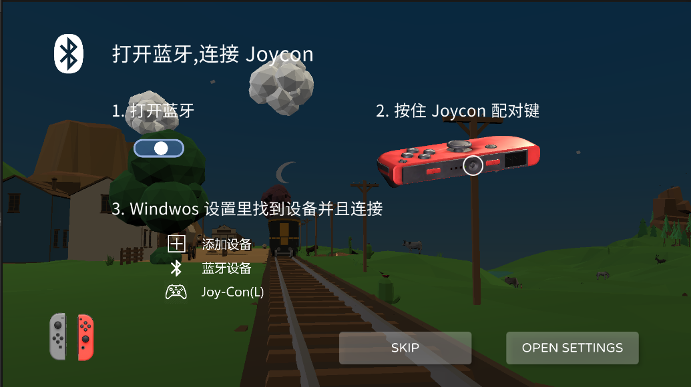

首先点击 `OPEN SETTINGS` 按钮,  打开蓝牙设置，点击开启蓝牙，按住 Joycon 配对键，然后在 Windows 蓝牙设备中点击如下按钮:

如果其中之一连接上你可以看到:

| 左下角图片                                                   | 含义                                                       |
| ------------------------------------------------------------ | ---------------------------------------------------------- |
|  | 左 Joycon 已经连接并且识别成功，右 Joycon 还未连接或者识别 |
|  | 右 Joycon 已经连接并且识别成功，左 Joycon 还未连接或者识别 |

**Joycon 在连接上 Windows 之后可能需要等 5-10s 左右，游戏才能检测到**

#### 可能遇到的问题

1. Joycon 在 Windows 里显示已配对，但是游戏检测不到

Joycon 必须是 **已连接** 状态游戏才能检测。请删除设备重新按照上述步骤连接

2. Joycon 无法连接 Windows

Joycon 没电了

3. Joycon 延迟高

重启电脑或者换个 Joycon 试试

## 开始游戏

开始界面:

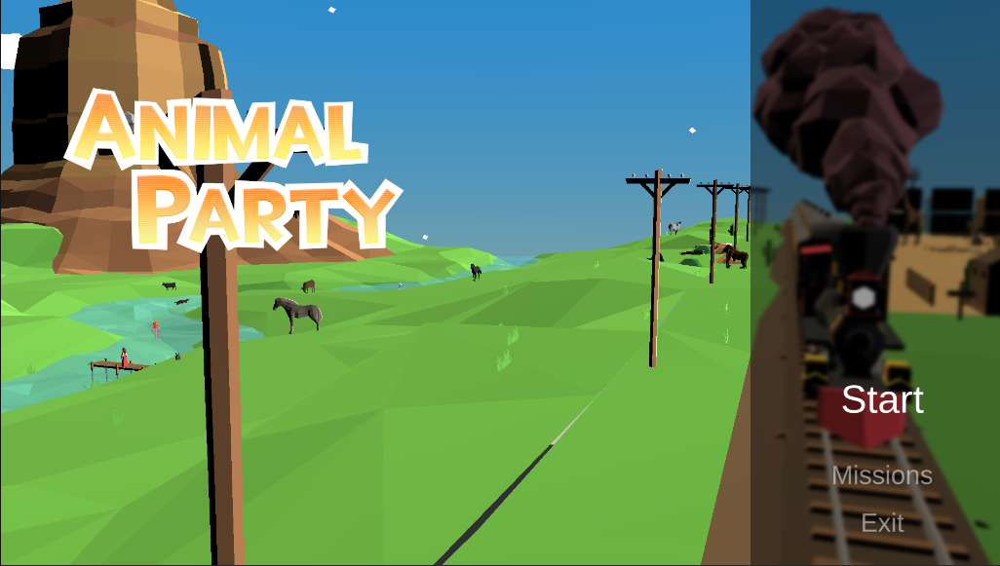

右手 Joycon 上下移动， 键选择。

选择 **Start** 即可从教学关卡开始游戏。

选择 **Missions** 即可选择关卡

选择 **Exit** 退出游戏

##  游戏中的按键与图标含义

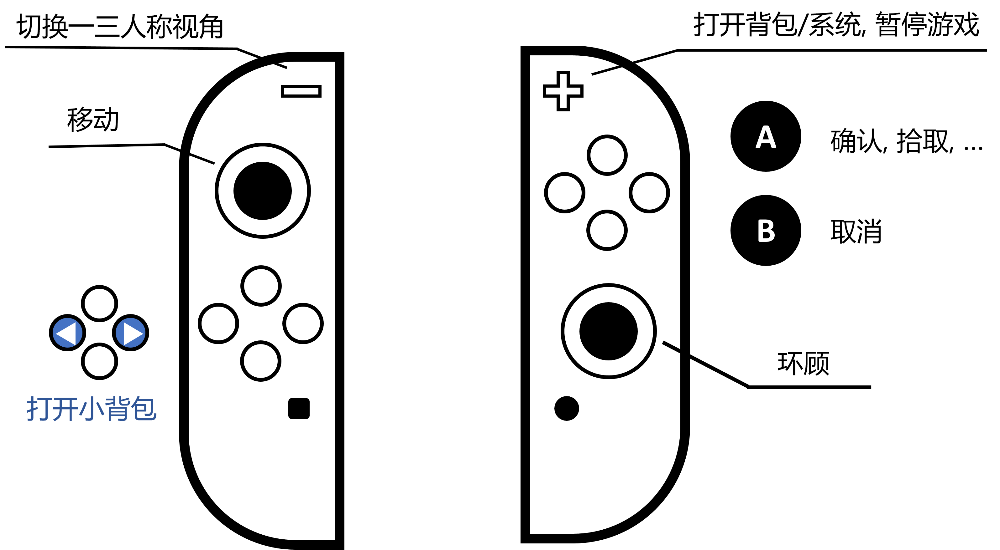

在游戏中按  , 然后按 **ZR** 就可以看到上面的提示

## 背包

在关卡中，您可以在任何时候打开背包，您可以点击 右 Joycon 的  按键打开背包 （时间会暂停）。

或者左手 Joycon 的    按键快速预览背包 （时间会减速为原来的 1%）。

### 完整背包

通过摇杆  来上下移动选择框选择物品

按  选择物品并且关闭 UI

按  取消选择，这时候您手里还是原来的物品

### 快速预览背包

快速预览背包可以让您快速选择物品。

通过摇杆  来左右移动选择框选择物品

按  选择物品并且关闭 UI

按  取消选择，这时候您手里还是原来的物品

## 关卡选择

在开场动画的时候要选择关卡请进入 **Missions** 选项。

在游戏过程中您也可以切换关卡：

1. 点击 右 Joycon 的  按键打开背包
2. 点击     进入系统界面
3. 点击  选择 Missions

然后您会看到如下界面:

通过摇杆  来上下移动选择框选择关卡

按  选择关卡

按  取消选择

## 游戏流程

### 0. 教学关卡

在教学关卡中, 您会看到一些提示，一般性按  即可继续。

首先是 Joycon 摇杆的使用和测试:

这里可以看到中间的虚拟摇杆表示我们已经读到摇杆的输入。在这里您可以测试摇杆是否正常工作，并且熟悉操作。

然后您会被要求去拾取香肠，切换视角等操作，只要按照指示做就行了。如下是一些案例

**要结束这个关卡按  **  **即可**

### 1. 第一关

第一关要求你把大象带到终点。但是你必须给大象喂食，才能博取大象好感，大象才会跟随你。同时你要提防蛇对大象的攻击。

首先是了解我们的小地图:

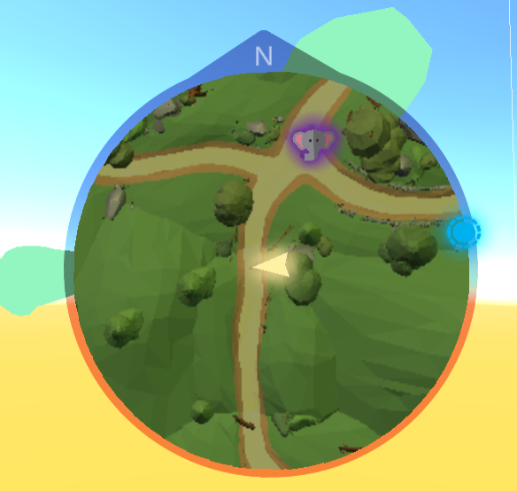

| 图标                                                         | 含义           |
| ------------------------------------------------------------ | -------------- |
|  | 代表大象的位置 |
| 

 | 代表终点位置   |
|  | 当前玩家位置   |

在路上会有蛇来进攻，你必须按住  并且挥动 Joycon 攻击蛇。

### 2. 第二关

第二关需要你根据猩猩的需要给猩猩喂食。所有的食物都散落在地上。猩猩头上的气泡会告诉您要喂食什么。

这一关里你可能需要用到背包。

### 3. 第三关

第三关你需要想获取鱼竿，然后走到船上 （如图发光处）

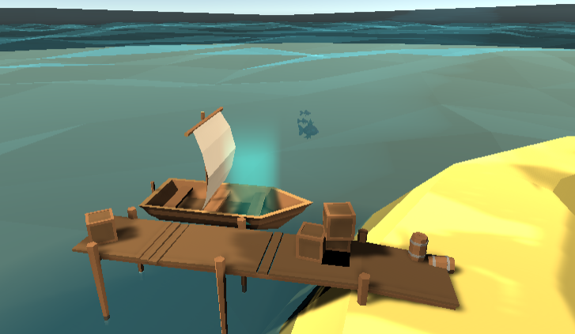

甩动 Joycon 从而甩出鱼竿，按  开始钓鱼，这时候你需要不断旋转 Joycon 收鱼线，保证力道标识位置在中央绿色处。

### 4. 第四关

这一关你至于要捡起地面上的老干妈，按住  键向前抛掷，只要砸中企鹅，企鹅就会吃下去。投喂10次即可三星过关。

### 5. 第五关

第五关的任务是给饥饿的小鸡喂食玉米。在这一关，你需要水平手持JoyCon(R)手柄，并模仿剥玉米的动作，转动JoyCon(R)手柄。

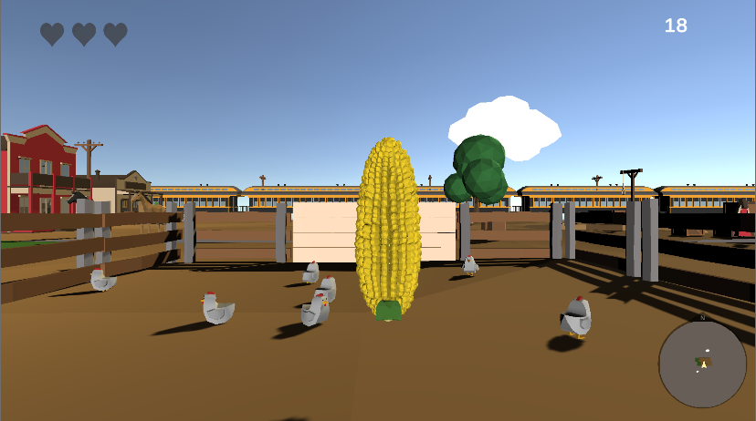

在转动玉米的过程中，玉米粒会不断弹出，随着玉米粒的增多，左上角的爱心会逐渐增多，游戏结束后，你将会收获与爱心数目相同的星级评价。

当然，当右上角的倒计时结束后或者你收集满了爱心后，游戏就会结束。

  

## 键盘映射

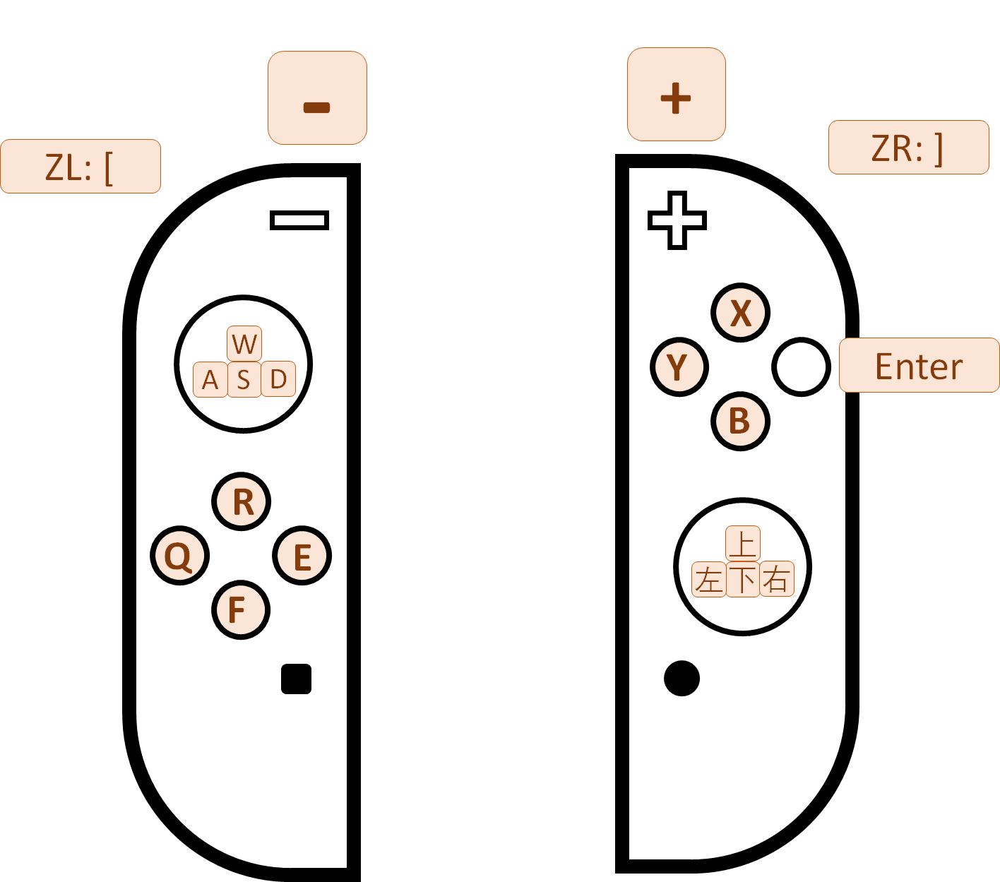

> Shift 按键是对应按下 Joycon 的摇杆，即加速奔跑。